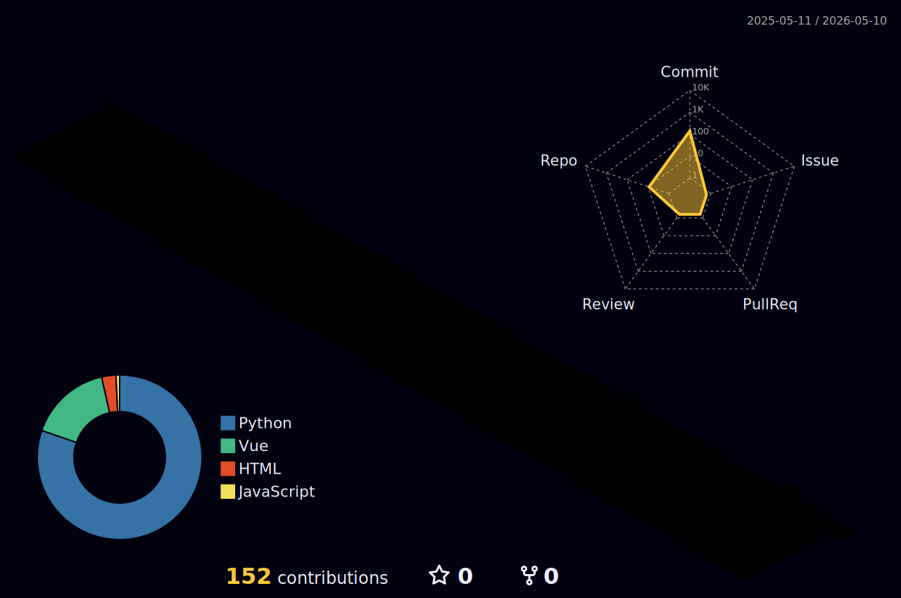

# ⚡ Welcome to N1rvana's Cyber Terminal ⚡

  

 

  
  

 

### 🤖 AI Core Sentinel Log
<!-- START_SECTION:ai_quote -->
> **[System Alert]:** AI Core disconnected. Retrieving cached protocols... // Standby.
<!-- END_SECTION:ai_quote -->

 

### 🎵 Neural Link Audio (Now Playing)

  <!-- 替换下面 URL 的 id 为你的网易云音乐实际 UID ，这个第三方 API 就是用来拉取网易云资料的 -->
  

 

### ♟️ Hacker Terminal: Tic-Tac-Toe

  <!-- readme-tic-tac-toe -->
  <!-- readme-tic-tac-toe -->

 

### 🐍 Contribution Matrix (贡献度矩阵)

  <picture>
    <source media="(prefers-color-scheme: dark)" srcset="https://raw.githubusercontent.com/N1rvana-git/N1rvana-git/output/github-snake-dark.svg">
    <source media="(prefers-color-scheme: light)" srcset="https://raw.githubusercontent.com/N1rvana-git/N1rvana-git/output/github-snake.svg">
    
  </picture>

 

  <picture>
    <source media="(prefers-color-scheme: dark)" srcset="./profile-3d-contrib/profile-night-rainbow.svg">
    <source media="(prefers-color-scheme: light)" srcset="./profile-3d-contrib/profile-green-animate.svg">
    
  </picture>

 

  

